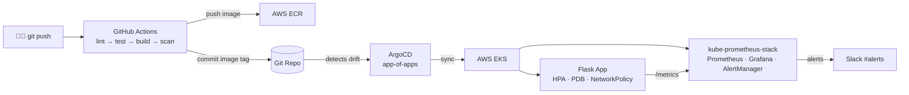

# GitOps DevOps Showcase

A production-grade platform demonstrating full-lifecycle DevOps: IaC, GitOps, CI/CD, and Observability — all from a single repository. One `git push` deploys the app with zero manual steps.

## Architecture



## Stack

| Layer | Technology |
|---|---|
| Cloud infra | AWS EKS, VPC, ECR, ALB |
| IaC | Terraform 1.8 + community modules |
| GitOps | ArgoCD 2.x (app-of-apps pattern) |
| CI/CD | GitHub Actions (OIDC — no static AWS credentials) |
| App | Python 3.12, Flask 3, prometheus-client, Gunicorn |
| Observability | kube-prometheus-stack (Prometheus, Grafana, AlertManager) |
| Security | Trivy in CI, NetworkPolicy, non-root container, IRSA |

## Repository Layout

```
execon-platform/
├── app/          Flask microservice + tests + Dockerfile
├── infra/        Terraform modules (vpc, eks, ecr, github-oidc) + dev environment
├── charts/       Helm charts: flask-app (7 resources) and monitoring
├── manifests/    ArgoCD Application CRDs (app-of-apps)
└── .github/      CI pipeline + Terraform plan workflow
```

## Prerequisites

- AWS CLI configured (`aws sts get-caller-identity` succeeds)
- Terraform 1.8+, kubectl, Helm 3, ArgoCD CLI, Docker

## Setup

### 1 — Bootstrap remote state (once)

```bash
cd infra/bootstrap
terraform init
terraform apply -var="state_bucket_name=execon-tfstate-$(openssl rand -hex 4)"
```

### 2 — Provision infrastructure (~15 min)

```bash
cd infra/environments/dev
# Edit backend.tf: set bucket name from step 1
# Edit terraform.tfvars: set github_org
terraform init && terraform apply
aws eks update-kubeconfig --name execon-dev --region eu-west-1
```

### 3 — Push repo to GitHub and bootstrap GitOps

```bash
git remote add origin https://github.com/YOUR_GITHUB_ORG/execon-platform.git
git push -u origin main
kubectl apply -f manifests/root-app.yaml
```

ArgoCD syncs `manifests/` and deploys the Flask app and monitoring stack automatically.

### 4 — Configure

Repository secrets (Settings → Secrets and variables → Actions):

| Secret | Used by | Value |
|---|---|---|
| `AWS_ROLE_ARN` | `ci.yaml` | `github_actions_role_arn` output from step 2 |
| `AWS_TERRAFORM_PLAN_ROLE_ARN` | `terraform-plan.yaml` | `terraform_plan_role_arn` output from step 2 |
| `AWS_ACCOUNT_ID` | `ci.yaml` | builds the ECR registry URL — see [ADR 0004](docs/adr/0004-secrets-and-identifier-handling.md) |

The image registry is **not** committed to this repo, because Argo CD reads only
from git and anything placed there is public. Inject it when bootstrapping:

```bash
kubectl -n argocd patch application flask-app --type merge -p \
  '{"spec":{"source":{"helm":{"parameters":[
     {"name":"image.repository","value":"<account>.dkr.ecr.<region>.amazonaws.com/flask-app"}]}}}}'
```

Leaving it unset is safe — the chart fails at render time with instructions
rather than deploying a broken pod.

Still a placeholder, and the reason this repo is not yet clone-and-run on AWS:
- `charts/monitoring/values.yaml` → `YOUR_SLACK_WEBHOOK_URL`, which should move
  to a secret rather than a chart value
- Grafana's admin secret must be created by hand before the monitoring app syncs

### Before pushing

```bash
make lint     # renders both charts, scans for secrets, checks Terraform
make hooks    # installs the pre-commit secret scan
```

## Access

```bash
# ArgoCD UI
kubectl -n argocd get svc argocd-server -o jsonpath='{.status.loadBalancer.ingress[0].hostname}'

# Flask app
kubectl -n flask-app get ingress flask-app -o jsonpath='{.status.loadBalancer.ingress[0].hostname}'

# Grafana (admin / changeme-set-via-secret)
kubectl -n monitoring get svc monitoring-grafana -o jsonpath='{.status.loadBalancer.ingress[0].hostname}'
```

## Tear Down

```bash
cd infra/environments/dev && terraform destroy
```
